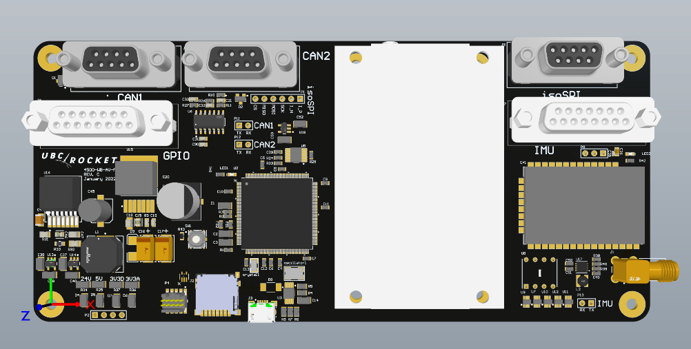

# WB-AV-4500-FC
Whistler-Blackcomb Flight Computer PCB Altium Files. This is the main controlling unit that is in charge of telemetry, apogee detection and managing the separate data acquisition boards. The firmware for this pcb can be found [here](https://github.com/UBC-Rocket/Whistler-Blackcomb-v2). 

This is a (potentially out of date unless someone remembers to update it) render of the pcb: 

